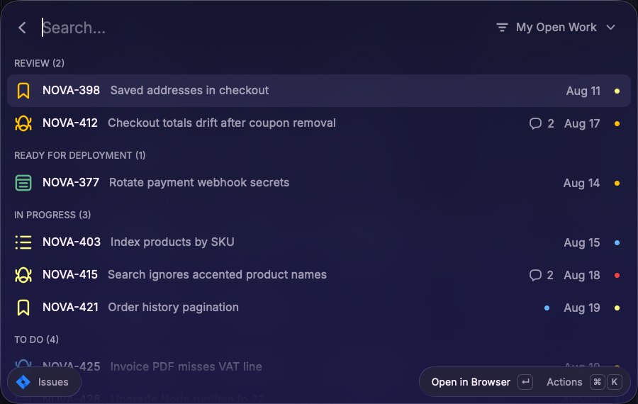
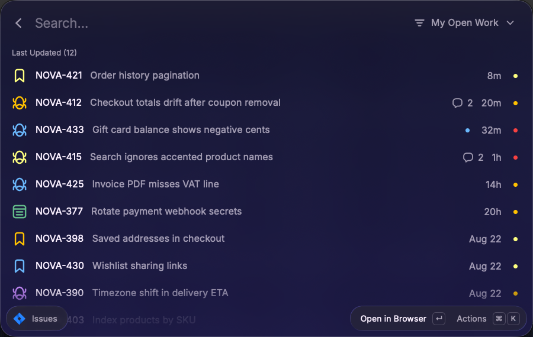

<div align="center">
  
  <h1>Jira Navigator</h1>
  <p>🧭 A Raycast extension to triage your Jira tickets by what needs doing next.</p>
</div>





## Commands

| Command    | What it does                                                                 |
| ---------- | ---------------------------------------------------------------------------- |
| Issues     | Your tickets grouped by actionable status, scoped by your saved Jira filters |
| Open Issue | Jump to any ticket by key from the argument or clipboard                     |

## Issues

One list, grouped by what each ticket needs from you, most urgent first:

- **BLOCKED** - flagged / impediment tickets, whatever their status.
- **REVIEW** - status `Review`.
- **READY FOR DEPLOYMENT** - status `Ready for Deployment`.
- **IN PROGRESS** - any other `In Progress` category status.
- **TO DO** - `To Do` category.
- **RECENTLY DONE** - completed within the last N days (configurable).

The named sections come before the category catch-alls, so a new or unknown
in-progress status still surfaces. Empty sections are hidden. The list opens as
a flat **Last Updated** sort; `⌘S` cycles on to the sectioned grouping, then
Creation Date and Priority, and the mode you leave it on is remembered for the
next launch. Within the sectioned grouping, tickets read oldest-created first,
so the longest-waiting ones surface at the top. The date accessory shows the
date the active view sorts by: creation date in the sectioned grouping and
Creation Date views, last update elsewhere. The flat sorts keep each ticket
tinted with its section color; typing filters by key, number, summary, status,
or type.

### Scopes

Scopes are Jira **saved filters**: each one's JQL fully defines what the list
shows, so new scopes are created and edited in Jira, not in the extension.
**Manage Scopes** (`⌘⇧F`) browses every saved filter visible to the account -
yours, shared, any name - and ⏎ toggles which appear in the scope dropdown.
The selection is stored locally, so each teammate on a shared account curates
their own; reopening Manage Scopes syncs renames and deletions made in Jira.

Jira's built-in filters ("My open issues", "Reported by me", …) are not saved
filters and cannot be referenced by the API; use "Save as" in Jira once, then
select the copy. RECENTLY DONE is windowed client-side, so long-done tickets
fetched by a filter (say, requirements you reported) stay reachable in the
flat sorts. With nothing selected, a fallback scope shows your last 48 hours
of assigned activity, newest first.

### Activity

A blue dot marks tickets with new activity since your last visit; a bubble
counts unread comments from others. `⌘⇧M` marks the selected ticket seen,
`⌘⌥M` all of them. Nothing counts as "new" on first launch.

### Changing status

**Change Status** (`⌘T`) lists the ticket's available transitions. The change
shows immediately but is held for a few seconds (configurable), during which
**Undo** in the toast cancels it with no Jira call. Transitions that need a
Jira screen or required field are omitted - open those in the browser. This is
the extension's only write action.

### Copy actions

| Shortcut | Copies                          |
| -------- | ------------------------------- |
| ⌥+C      | Issue key (`PROD-123`)          |
| ⌘+C      | URL                             |
| ⌘+⌥+C    | Key and summary                 |
| ⌘+⇧+C    | Markdown link                   |
| ⌘+⇧+⌥+C  | Markdown link with summary      |

### Hiding

`⌘⇧H` hides the selected ticket, `⌘⇧P` its whole project - useful when a
shared filter drags in noise you can't edit away.

### Custom sections

Set **Section Config** to a JSON array to override the defaults. Each section:

```json
[
  { "title": "REVIEW", "color": "orange", "statuses": ["Review", "Code Review"] },
  { "title": "IN PROGRESS", "color": "yellow", "category": "In Progress" },
  { "title": "TO DO", "color": "blue", "category": "To Do" },
  { "title": "RECENTLY DONE", "color": "purple", "recentDone": true }
]
```

Matchers, checked in order: `flagged` → `recentDone` → `statuses` (by name,
case-insensitive) → `category` (To Do / In Progress / Done). Colors: `red`,
`orange`, `yellow`, `green`, `blue`, `purple`, `gray`.

## Open Issue

Give it a key (`PROD-1234`) as an argument, or leave it empty to read the
clipboard, and the ticket opens in the browser. A bare number uses the
**Fallback Project Key** preference (`1234` opens `PROD-1234`); any other text
opens Issues pre-filtered by that term. Supports tab reuse: an already-open
tab for the ticket is focused instead of spawning a new one.

## Preferences

- **Jira Site** - Atlassian Cloud host, without protocol.
- **Account Email** - Atlassian account email for the API token.
- **API Token** - Atlassian API token.
- **Fallback Project Key** - project assumed when Open Issue gets a bare number.
- **Recently Done Threshold (days)** - RECENTLY DONE window (default 3, 0 hides Done).
- **Status Change Delay (seconds)** - Undo window before a status change reaches Jira.
- **Section Config** - JSON array overriding the default sections.
- **Browser / Tab Reuse / Browser App Override** - which browser opens tickets; Chromium browsers and Safari can focus an already-open tab.

## Getting Started

### Step 1: Create an Atlassian API token

1. Go to https://id.atlassian.com/manage-profile/security/api-tokens.
2. Create a token and copy it.
3. Set **Jira Site** (e.g. `your-team.atlassian.net`), **Account Email**, and
   **API Token** in the extension preferences.

### Step 2: Install the extension

This extension is installed from source:

```sh
git clone https://github.com/dportalesr/jira-navigator.git
cd jira-navigator
npm install
npm run dev
```

`npm run dev` builds the extension and loads it into Raycast in development
mode; after the first run it stays installed. Requires
[Raycast](https://raycast.com) and Node.js.

## Development

- `npm run dev` - live-reloading development build.
- `npm run build` - production build.
- `npm run lint` - ESLint + Prettier via `ray lint`.
- `npm test` - unit tests via Jest (pure logic: JQL, sections, scopes, selection, caches).

MIT licensed.
